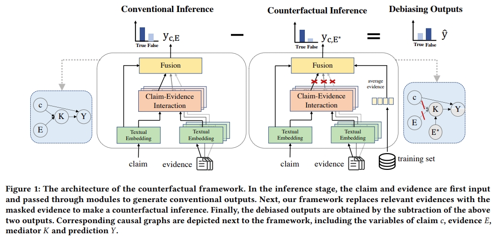

# CF-FEND



This is the code for the Paper: [Bias Mitigation for Evidence-aware Fake News Detection by Causal Intervention](https://dl.acm.org/doi/abs/10.1145/3477495.3531850).

## Usage

Our dataset can be downloaded by this [link](https://drive.google.com/file/d/1rzIecFRwNQuc6nzVD8IyVLUlT-Obxjgc/view?usp=sharing). Place it in the same directory as counterfactual_inference.

You can run the bash scripts in the directory (run) to train and test models (MAC/bert) on Snopes (sens) or PolitiFact (pomt) Dataset. 

For example, run the mac model on Snopes:

```
sh run/run_mac_snes.sh
```

## Requirements

Required packages are in requirements.txt. You can install packages as follows:

```
pip install -r requirements.txt
```

## Citation

Please cite our paper if you use the code:

```
@inproceedings{wu2022bias,
  title     = {Bias Mitigation for Evidence-aware Fake News Detection by Causal Intervention},
  author    = {Wu, Junfei and Liu, Qiang and Xu, Weizhi and Wu, Shu},
  booktitle = {Proceedings of the 45th International ACM SIGIR Conference on Research and Development in Information Retrieval},
  pages     = {2308--2313},
  year      = {2022}
}
```

### Acknowledge

We refer to the work and code of [fake news reasoning](https://github.com/casperhansen/fake-news-reasoning). We sincerely thank them for their great contribution to the research community of fake news detection.
